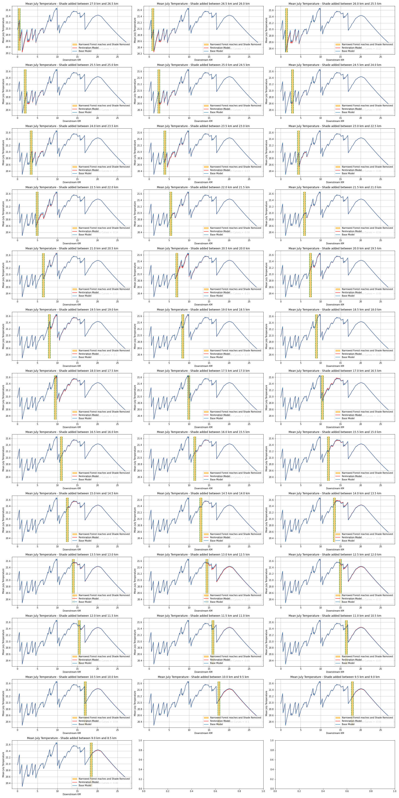

# Repository for running shade restoration scenarios in the West Fork Kickapoo Watershed in SW Wisconsin

## example of a figure generated by adding shade to 500m reaches, simulating a restoration project

